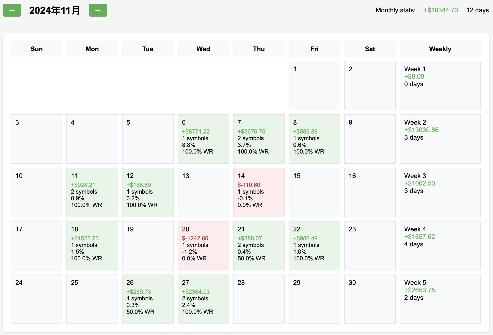
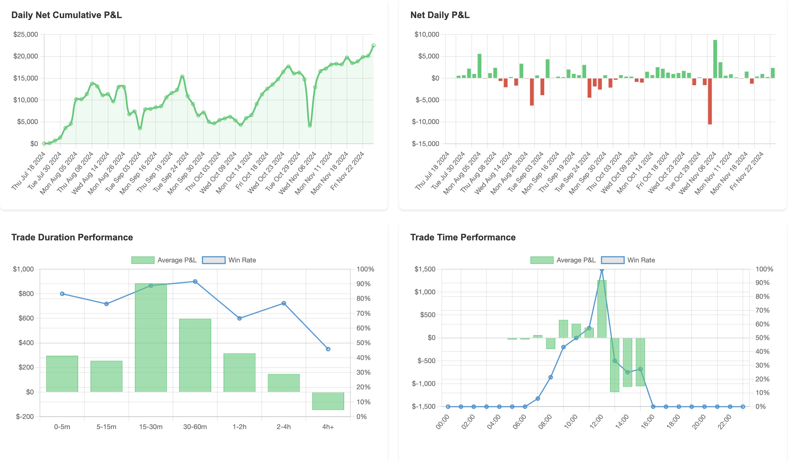
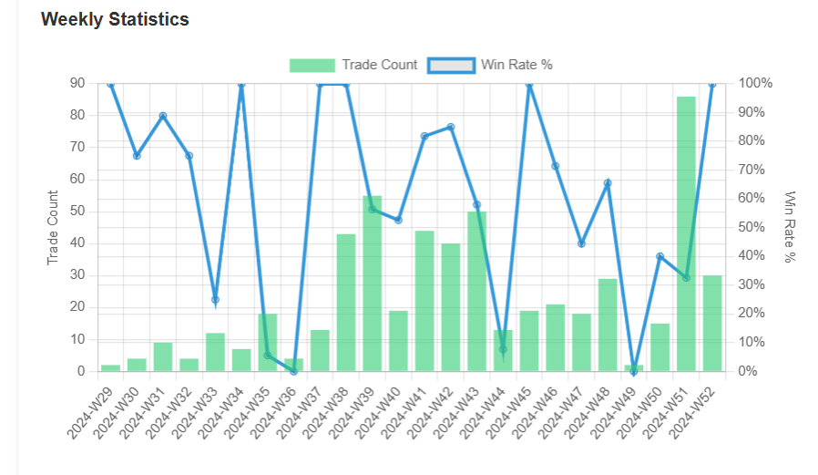
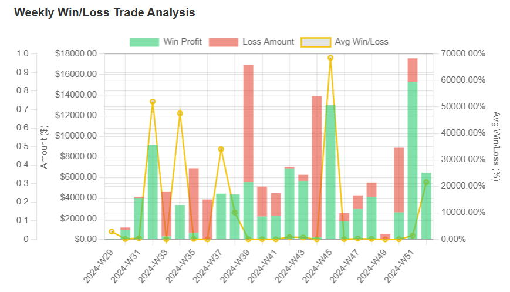
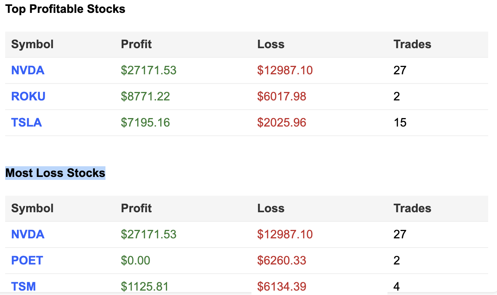
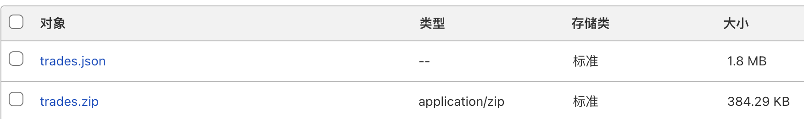
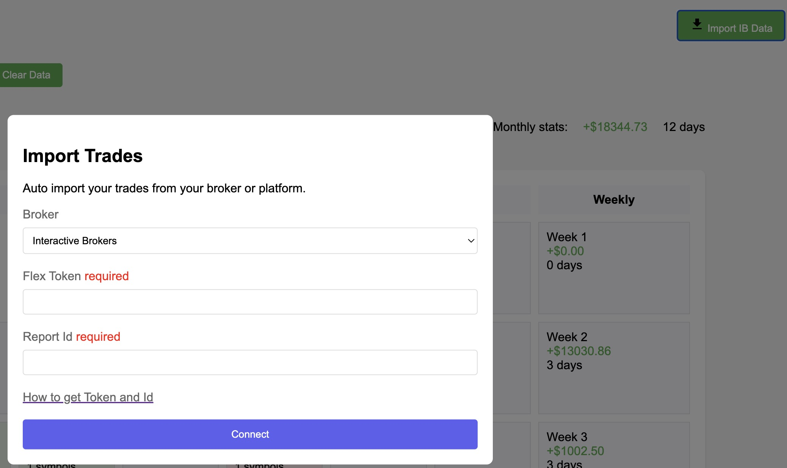

# Trade Calendar with PnL Visualization

## Table of Contents

- [Purpose](#purpose)
- [Demo](#demo)
- [Screenshots](#screenshots)
- [New Feature](#new-feature)
- [Features](#features)
- [How to Use](#how-to-use)
- [Additional Steps(Other brokers)](#additional-stepsother-brokers)
- [Recommended Broker](#recommended-broker)

## Purpose

This PnL Calendar Tool is designed for active traders and investors to manage and analyze their trading performance visually. By integrating daily profit and loss (PnL) data into an intuitive calendar format, it provides a powerful way to monitor, evaluate, and improve trading strategies.

## Demo

Try this: [Demo](https://pnl.broyustudio.com/)

## Screenshots

## New Feature

- Add two charts "Weekly Statistics" and "Weekly Win/Loss Trade Analysis"

- Add "Top Profitable Stocks" and "Most Loss Stocks" Lists

- CloudFlare R2 storage and sync

- Zipped json file to 20% size

## Features

### 1. Interactive Calendar View

- Displays daily and weekly PnL summaries with dynamic color-coded cells.

- Identifies winning and losing days at a glance.

### 2. Detailed Trade Analysis

- Clickable dates to view detailedtrade data, including individual trade metrics like ROI, PnL, and performance indicators.

### 3. Statistical Insights

- Summarizes monthly performance statistics: net PnL, win rates,profit factor, and average trade outcomes.
- Visualizes trends with charts fordaily PnL, cumulative PnL, trade durations, and drawdowns.

### 4. Data Import

- Seamlessly import trading datafrom Interactive Brokers (IBKR) usingFlex Queries.
- Supports CSV uploads for manual trade data input.

### 5. Customizable Date Ranges

- Analyze specific time periods using the built-in date range picker.

## How to Use

### 1. Set Up

- Open the main.html file in any modern browser.
- Ensure your trading data is accessible in CSV format or via Interactive Brokers Flex Queries.
- Default proxy(for CORS) is my personal CloudFlare worker, please replace it with yours for security.

### 2.	Import Data:
- Click “Import IB Data” in the toolbar.

- Enter your IBKR Flex Token and Report ID to fetch your trading data.[The how-to guide from tradezella document](https://intercom.help/tradezella-4066d388d93c/en/articles/6063403-interactive-broker-how-to-sync-your-interactive-broker-ibkr-account-with-tradezella)
- Alternatively, upload a CSV file containing your trade history, which's still exported from IB flex queries.

### 3.	Explore Your Performance:
- Navigate through months to view daily and weekly summaries.
- Click on any day to see detailed trade data.
- Use the toolbar to filter by custom date ranges.
### 4.	Analyze Trends:
- Scroll down to view cumulative PnL, trade duration insights, andother advanced metrics through dynamic charts.
### 5.	Save and Manage Data:
- All data is stored locally inyour browser. Use the “Clear Data”button to reset when needed.

## Using a Proxy to Handle CORS Issues

The tool integrates with Interactive Brokers’ Flex Queries API, which requires a server-side proxy to bypass CORS restrictions when fetching data. A proxyUrl is used for this purpose in the code.

Setting Up a Proxy with Cloudflare Workers

You can easily set up your own proxy using Cloudflare Workers([code example](./worker.js)). 

Deploying Your Proxy

	1.	Log in to your Cloudflare dashboard.
	2.	Navigate to Workers > Create a Service.
	3.	Copy the worker.js code into the script editor.
	4.	Deploy your worker and note the assigned URL (e.g., https://your-worker-url.workers.dev).
	5.	Replace the proxyUrl in the tool’s JavaScript code with your worker’s URL.
    const proxyUrl = 'https://your-worker-url.workers.dev';

By setting up your proxy, you ensure a secure and reliable way to fetch API data without being affected by CORS restrictions.

## Additional Steps(Other brokers)
* if you want to try another broker, you might refer this: [IB CSV file](./example_ib.csv)
* By now, there're a few fields necessary of the trade:
	1.	TransactionID: 
A unique identifier for each trade.
	2.	Symbol: 
The code of the traded instrument (e.g., stock or other assets).
	3.	TradeDate: 
The date when the trade occurred.
	4.	Open/CloseIndicator: 
Indicates whether the trade is an open or close position, with common values being O (Open) or C (Close).
	5.	DateTime: 
The timestamp of the trade.
	6.	Quantity: 
The number of shares/contracts traded.
	7.	FifoPnlRealized: 
The realized profit or loss of the trade.
	8.	Buy/Sell: 
Indicates whether the trade is a buy or sell operation.
	9.	OrderTime: 
The time when the trade order was placed.

Usage Explanation:

	•	These fields are used for daily, weekly, and monthly PnL calculations (e.g., FifoPnlRealized and TradeDate).
	•	Used for summarizing trade statistics by instrument (e.g., Symbol and Quantity).
	•	The Open/CloseIndicator distinguishes open and close trades and is used to categorize them in the calendar.
	•	Key trade information (e.g., Buy/Sell, DateTime, and FifoPnlRealized) is displayed in the detailed trade view.
	•	DateTime and OpenDateTime are used to calculate trade duration performance.

If you need additional clarification or further details about any field, let me know!

## Recommended Broker

To experience seamless trading data integration and low-cost trading services, we highly recommend using Interactive Brokers (IBKR). Start your journey with one of the most powerful trading platforms today.

## Sign up here: [Interactive Brokers Referral Link](https://ibkr.com/referral/yu950)

Enjoy analyzing your trades and making better-informed decisions with this tool! Let us know if you have any feedback or suggestions.

## License
This project is licensed under the Creative Commons Attribution-NonCommercial-NoDerivs 4.0 International License - see the [LICENSE](LICENSE) file for details.