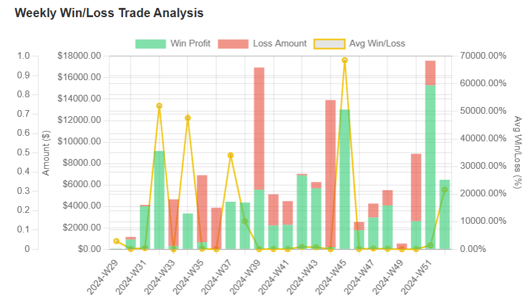
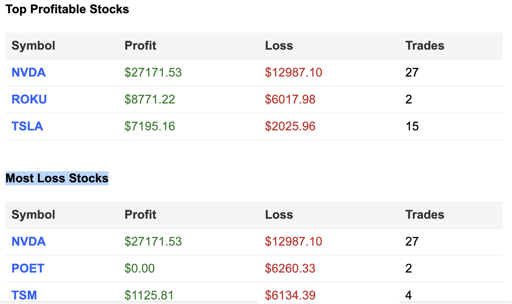
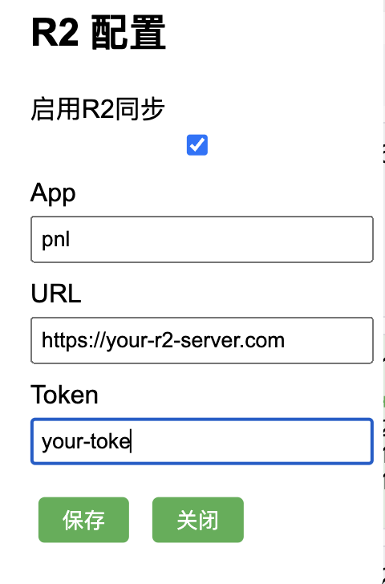
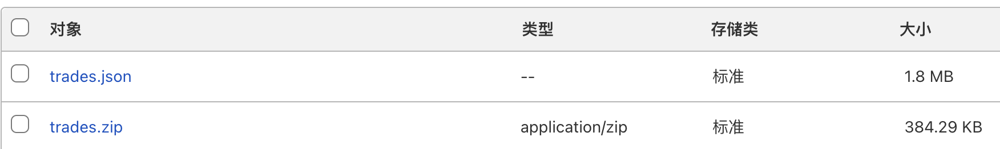
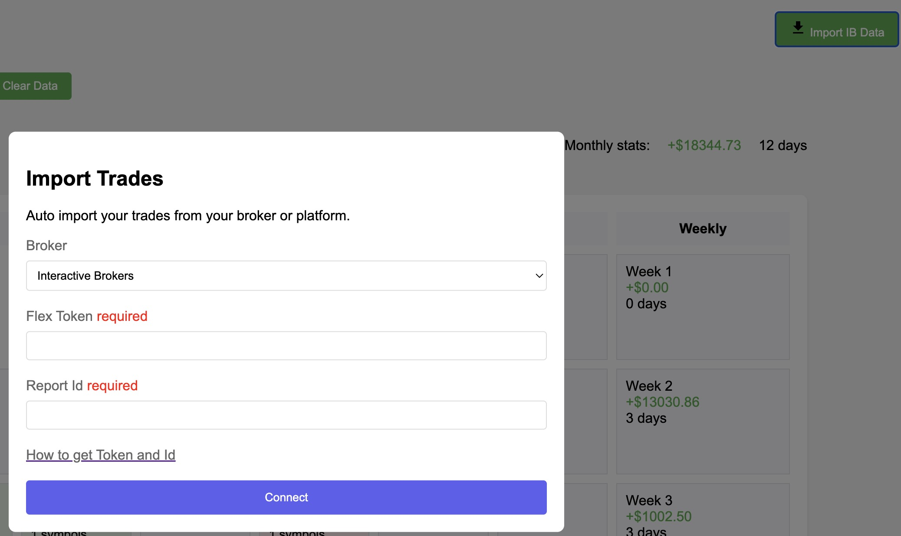

# 交易日历与盈亏可视化

## 目录

- [目的](#目的)
- [演示](#演示)
- [截图](#截图)
- [新功能](#新功能)
- [特性](#特性)
- [使用方法](#使用方法)
- [额外步骤（其他券商）](#额外步骤其他券商)
- [推荐券商](#推荐券商)

## 目的

### 完全在您的浏览器本地运行，不上传任何数据

这个盈亏日历工具专为活跃交易者和投资者设计，用于可视化管理和分析他们的交易表现。通过将每日盈亏(PnL)数据整合到直观的日历格式中，它提供了一种强大的方式来监控、评估和改进交易策略。

## 演示

试用链接：[演示](https://pnl.broyustudio.com/)

## 截图

## 新功能

- 添加了两个图表"每周统计"和"每周盈亏交易分析"

- 添加了"最盈利股票"和"最亏损股票"列表

- CloudFlare R2 存储和同步

- 压缩 json 文件至原大小的 20%

## 特性

### 1. 交互式日历视图

- 显示每日和每周盈亏摘要，带有动态颜色编码的单元格。
- 一目了然地识别盈利和亏损日。

### 2. 详细交易分析

- 可点击日期查看详细交易数据，包括个别交易指标如 ROI、盈亏和表现指标。

### 3. 统计洞察

- 汇总月度表现统计：净盈亏、胜率、盈利因子和平均交易结果。
- 通过图表可视化趋势，包括每日盈亏、累计盈亏、交易持续时间和回撤。

### 4. 数据导入

- 使用 Flex 查询无缝导入盈透证券(IBKR)的交易数据。
- 支持 CSV 上传，用于手动输入交易数据。

### 5. 可自定义日期范围

- 使用内置日期范围选择器分析特定时间段。

## 使用方法

### 1. 设置

- 在任何现代浏览器中打开 main.html 文件。
- 确保您的交易数据可以通过 CSV 格式或盈透证券 Flex 查询访问。
- 默认代理(用于 CORS)是我个人的 CloudFlare worker，出于安全考虑，请替换为您自己的。

### 2. 导入数据：
- 点击工具栏中的"导入 IB 数据"。

- 输入您的 IBKR Flex Token 和 Report ID 以获取您的交易数据。[来自 tradezella 文档的操作指南](https://intercom.help/tradezella-4066d388d93c/en/articles/6063403-interactive-broker-how-to-sync-your-interactive-broker-ibkr-account-with-tradezella)
- 或者，上传包含您的交易历史的 CSV 文件，该文件仍然从 IB flex 查询导出。

### 3. 探索您的表现：
- 浏览月份以查看每日和每周摘要。
- 点击任何一天查看详细的交易数据。
- 使用工具栏按自定义日期范围进行筛选。

### 4. 分析趋势：
- 向下滚动查看累计盈亏、交易持续时间洞察和通过动态图表展示的其他高级指标。

### 5. 保存和管理数据：
- 所有数据都存储在您的浏览器本地。需要时使用"清除数据"按钮重置。

## 使用代理处理 CORS 问题

该工具与盈透证券的 Flex 查询 API 集成，在获取数据时需要服务器端代理来绕过 CORS 限制。代码中使用了 proxyUrl 来实现这一目的。

使用 Cloudflare Workers 设置代理

您可以使用 Cloudflare Workers 轻松设置自己的代理([代码示例](./worker.js))。

部署您的代理

1. 登录到您的 Cloudflare 控制面板。
2. 导航到 Workers > 创建服务。
3. 将 worker.js 代码复制到脚本编辑器中。
4. 部署您的 worker 并记下分配的 URL（例如，https://your-worker-url.workers.dev）。
5. 将工具的 JavaScript 代码中的 proxyUrl 替换为您的 worker 的 URL。
`const proxyUrl = ' https://your-worker-url.workers.dev ';` 
通过设置您的代理，您可以确保一种安全可靠的方式来获取 API 数据，而不受 CORS 限制的影响。

## 额外步骤（其他券商）
* 如果您想尝试其他券商，可以参考：[IB CSV 文件](./example_ib.csv)
* 目前，交易中有几个必要的字段：
 1. TransactionID：
每笔交易的唯一标识符。
 2. Symbol：
交易工具的代码（例如，股票或其他资产）。
 3. TradeDate：
交易发生的日期。
 4. Open/CloseIndicator：
表示交易是开仓还是平仓，常见值为 O（开仓）或 C（平仓）。
 5. DateTime：
交易的时间戳。
 6. Quantity：
交易的股票/合约数量。
 7. FifoPnlRealized：
交易的已实现盈亏。
 8. Buy/Sell：
表示交易是买入还是卖出操作。
 9. OrderTime：
下单时间。

使用说明：

* 这些字段用于每日、每周和每月盈亏计算（例如，FifoPnlRealized 和 TradeDate）。
* 用于按工具汇总交易统计（例如，Symbol 和 Quantity）。
* Open/CloseIndicator 区分开仓和平仓交易，并用于在日历中对它们进行分类。
* 关键交易信息（例如，Buy/Sell、DateTime 和 FifoPnlRealized）显示在详细交易视图中。
* DateTime 和 OpenDateTime 用于计算交易持续时间表现。

如果您需要任何字段的额外说明或更多详细信息，请告诉我！

## 推荐券商

为了体验无缝的交易数据集成和低成本交易服务，我们强烈推荐使用盈透证券(IBKR)。立即开始使用最强大的交易平台之一。

## 在此注册：[盈透证券推荐链接](https://ibkr.com/referral/yu950)

享受分析您的交易并做出更明智决策的乐趣！如果您有任何反馈或建议，请告诉我们。

## 许可证
本项目采用知识共享署名-非商业性使用-禁止演绎 4.0 国际许可证 - 详情请参阅 [LICENSE](LICENSE) 文件。